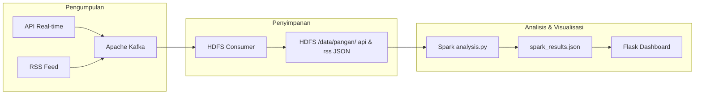

# README: Dokumentasi Pipeline Data Lakehouse (Medallion & Delta Lake)

Dokumentasi ini menjelaskan peningkatan arsitektur data pipeline **HargaPangan** dari model HDFS JSON mentah lama (ETS) menjadi arsitektur **Data Lakehouse** modern menggunakan **Medallion Architecture** dan **Delta Lake**.

---

## 1. Diagram Arsitektur: Sebelum vs Sesudah

### Arsitektur Lama (ETS - JSON Mentah)



### Arsitektur Baru (Data Lakehouse - Medallion Architecture + Delta Lake)

```mermaid
graph TD
    subgraph Data Sources
        API[API Real-time]
        RSS[RSS Feed]
    end

    subgraph Ingestion & Streaming
        API --> Kafka[Apache Kafka]
        RSS --> Kafka
        Kafka --> HDFS[HDFS /data/pangan/ api & rss JSON]
    end

    subgraph Lakehouse Layer (Delta Lake)
        HDFS -->|"01_bronze.py"| Bronze["🥉 Bronze Layer (Raw Delta Table) <br/> pangan_api & pangan_rss <br/> + _ingested_at, _source"]
        
        Bronze -->|"02_silver.py (Clean, Cast, Deduplicate)"| Silver["🥈 Silver Layer (Cleaned Delta Table) <br/> pangan_api & pangan_rss <br/> Tipe data benar, tanpa duplikat/null"]
        
        Silver -->|"03_gold.py (Aggregate, Window, Join)"| Gold["🥇 Gold Layer (Aggregated Delta Table) <br/> pangan_volatility, pangan_trend, pangan_alert, pangan_news"]
    end

    subgraph Dashboard BI
        Gold -->|"deltalake Python / spark_results.json fallback"| Flask[Flask Dashboard Backend]
        Flask --> UI[Web UI Monitor]
    end
```

---

## 2. Struktur Folder & Skrip

Struktur repositori yang ditambahkan untuk tugas ini adalah sebagai berikut:

```text
lakehouse/
├── 00_setup.md             ← Panduan instalasi dan persiapan environment
├── 01_bronze.py            ← Ingestion dari HDFS/Lokal ke Bronze Delta Table
├── 02_silver.py            ← Cleaning dan standarisasi ke Silver Delta Table & Demo Time Travel
├── 03_gold.py              ← Agregasi analitik & Enhanced logic ke Gold Delta Table
└── README_lakehouse.md     ← Dokumentasi lengkap arsitektur (File ini)
```

---

## 3. Detail Implementasi Lapisan Medallion

### A. Bronze Layer (`01_bronze.py`)

Mengambil file JSON mentah dari HDFS `/data/pangan/api` dan `/data/pangan/rss/` (atau fallback file JSON lokal jika HDFS tidak aktif) lalu menyimpannya apa adanya ke format Delta Lake di `./lakehouse_data/bronze/pangan_api` dan `./lakehouse_data/bronze/pangan_rss`.

- **Kolom Metadata Tambahan**:
  1. `_ingested_at` (Timestamp): Waktu masuknya data ke Danau Data (Data Lake).
  2. `_source` (String): Asal data (`"api"` atau `"rss"`).

### B. Silver Layer (`02_silver.py`)

Membaca data dari Bronze, lalu melakukan transformasi pembersihan data (QC) sebelum disimpan ke `./lakehouse_data/silver/pangan_api` dan `./lakehouse_data/silver/pangan_rss`.

**Transformasi yang dilakukan:**

1. **Deduplikasi (Hapus Duplikat)**: Menggunakan `.dropDuplicates(["timestamp", "komoditas", "harga"])` pada data API dan `["title", "published"]` pada data RSS untuk menjamin integritas data (tidak ada data tercatat ganda pada waktu yang sama).
2. **Type Casting (Penyelarasan Tipe Data)**: Mengubah harga menjadi tipe `double` dan string timestamp menjadi `TimestampType` agar dapat diproses secara matematis dan temporal oleh Spark.
3. **Filter Data Invalid & Null**: Membuang baris yang memiliki harga `null` atau `harga <= 0` untuk menghindari skewing saat visualisasi tren.
4. **Ekstraksi Temporal**: Menambahkan kolom `jam` (`hour(col("timestamp"))`) dan `tanggal` (`to_date(col("timestamp"))`) untuk mempermudah analisis waktu.
5. **Standarisasi Nilai**: Mengubah penulisan nama komoditas yang tidak konsisten (misal: "Beras Medium" -> "Beras").

### C. Gold Layer (`03_gold.py`)

Lapisan akhir yang siap dikueri oleh pengguna bisnis atau Dashboard. Kami membuat 4 tabel Gold dalam format Delta:

1. `gold/pangan_volatility` (Repro): Agregasi nilai Max, Min, Rata-rata, serta Indeks Volatilitas Harga per komoditas.
2. `gold/pangan_trend` (Repro): Rata-rata harga per periode menit/jam untuk line chart tren.
3. `gold/pangan_alert` (Enhanced): Early warning system mendeteksi fluktuasi harga > 5% dibanding observasi sebelumnya menggunakan **Window Functions** (`lag`).
4. `gold/pangan_news_correlation` (Enhanced): **Cross-source join** antara Silver API dan Silver RSS untuk mengaitkan jumlah artikel berita tentang suatu komoditas dengan rata-rata persentase fluktuasi harganya.

---

## 4. Demonstrasi Time Travel Delta Lake

Time Travel memungkinkan kita mengkueri snapshot data masa lalu menggunakan riwayat transaction log Delta Lake (`_delta_log`).

Di dalam `02_silver.py`, kami mendemonstrasikan ini dengan:

1. Menampilkan riwayat transaksi menggunakan `deltaTable.history()`.
2. Mengubah (update) harga Jagung yang di bawah Rp 6000 menjadi Rp 6000.
3. Membaca data saat ini (setelah ter-update) dan membandingkannya dengan data versi pertama sebelum ter-update menggunakan opsi `.option("versionAsOf", 0)`.

---

## 5. Refleksi: Keuntungan Nyata Delta Lake vs Flat HDFS/CSV

Dengan menerapkan Delta Lake sebagai format tabel, kami memperoleh keuntungan krusial dibanding menyimpan langsung di HDFS (berupa file JSON/CSV biasa):

1. **Jaminan Transaksi ACID**: Delta Lake menjamin operasi write, update, dan delete bersifat atomik melalui transaction log (`_delta_log`). Tidak ada data corrupt atau partial write akibat pipeline crash di tengah jalan.
2. **Schema Enforcement & Evolution**: Delta Lake memproteksi data dari "bad data" dengan memvalidasi skema secara otomatis. Jika skema berubah secara legal, kita dapat menggunakan opsi `mergeSchema` untuk melakukan evolusi skema tanpa merusak pipeline lama.
3. **Audit Trail & Time Travel**: Setiap modifikasi dicatat dalam log. Kami dapat melihat history audit (siapa, kapan, dan operasi apa yang dilakukan) dan melakukan rollback atau memanggil ulang data di masa lampau (`versionAsOf`). Hal ini krusial untuk melatih ulang model Machine Learning secara reprodusibel.
4. **Performa Query Lebih Cepat**: Delta Lake menyimpan file dalam format Parquet (columnar) terkompresi lengkap dengan file metadata, statistik min/max, dan partisi. Ini memungkinkan query engine melakukan skip file (data pruning) sehingga query analitik jauh lebih cepat dibandingkan memindai seluruh direktori JSON mentah.
