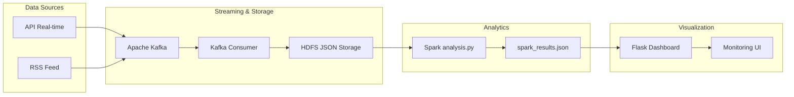
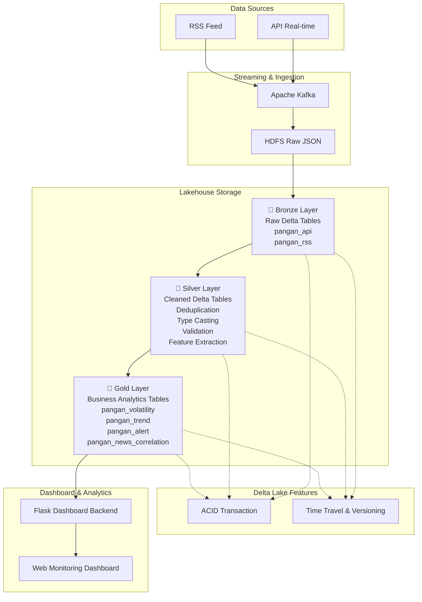

# README: Dokumentasi Pipeline Data Lakehouse (Medallion & Delta Lake)

Dokumentasi ini menjelaskan peningkatan arsitektur data pipeline **HargaPangan** dari model HDFS JSON mentah lama (ETS) menjadi arsitektur **Data Lakehouse** modern menggunakan **Medallion Architecture** dan **Delta Lake**.

---

## 1. Diagram Arsitektur: Sebelum vs Sesudah

### Arsitektur Lama (ETS - JSON Based Analytics)



**Kelemahan Arsitektur Lama:**

- Data hanya disimpan dalam format JSON mentah.
- Tidak memiliki versioning data.
- Tidak mendukung ACID Transaction.
- Tidak memiliki mekanisme Time Travel.
- Analisis harus dijalankan ulang dari data mentah setiap kali dibutuhkan.

---

### Arsitektur Baru (Data Lakehouse dengan Delta Lake)



### Alur Data

1. Data harga pangan dan berita dikumpulkan dari API dan RSS Feed.
2. Data dikirim melalui Apache Kafka dan disimpan dalam format JSON di HDFS.
3. `01_bronze.py` melakukan ingest data ke Bronze Layer sebagai Delta Table tanpa mengubah isi data.
4. `02_silver.py` melakukan proses cleaning dan transformasi seperti deduplikasi, validasi data, type casting, serta ekstraksi atribut waktu.
5. `03_gold.py` menghasilkan tabel analitik berupa:
   - Volatilitas harga komoditas
   - Tren harga
   - Alert perubahan harga
   - Korelasi berita dan harga
6. Dashboard Flask membaca data dari Gold Layer untuk kebutuhan visualisasi dan monitoring.
7. Seluruh layer Delta Lake mendukung ACID Transaction, Versioning, dan Time Travel sehingga histori data dapat diakses kembali kapan saja.

---

## 2. Struktur Folder & Skrip

Struktur repositori yang ditambahkan untuk tugas ini adalah sebagai berikut:

```text
lakehouse/
├── 00_setup.md             ← Panduan instalasi dan persiapan environment
├── 01_bronze.py            ← Ingestion dari HDFS/Lokal ke Bronze Delta Table
├── 02_silver.py            ← Cleaning dan standarisasi ke Silver Delta Table & Demo Time Travel
├── 03_gold.py              ← Agregasi analitik & Enhanced logic ke Gold Delta Table
└── README_lakehouse.md     ← Dokumentasi lengkap arsitektur (File ini)
```

---

## 3. Detail Implementasi Lapisan Medallion

### A. Bronze Layer (`01_bronze.py`)

Mengambil file JSON mentah dari HDFS `/data/pangan/api` dan `/data/pangan/rss/` (atau fallback file JSON lokal jika HDFS tidak aktif) lalu menyimpannya apa adanya ke format Delta Lake di `./lakehouse_data/bronze/pangan_api` dan `./lakehouse_data/bronze/pangan_rss`.

- **Kolom Metadata Tambahan**:
  1. `_ingested_at` (Timestamp): Waktu masuknya data ke Danau Data (Data Lake).
  2. `_source` (String): Asal data (`"api"` atau `"rss"`).

### B. Silver Layer (`02_silver.py`)

Membaca data dari Bronze, lalu melakukan transformasi pembersihan data (QC) sebelum disimpan ke `./lakehouse_data/silver/pangan_api` dan `./lakehouse_data/silver/pangan_rss`.

**Transformasi yang dilakukan:**

1. **Deduplikasi (Hapus Duplikat)**: Menggunakan `.dropDuplicates(["timestamp", "komoditas", "harga"])` pada data API dan `["title", "published"]` pada data RSS untuk menjamin integritas data (tidak ada data tercatat ganda pada waktu yang sama).
2. **Type Casting (Penyelarasan Tipe Data)**: Mengubah harga menjadi tipe `double` dan string timestamp menjadi `TimestampType` agar dapat diproses secara matematis dan temporal oleh Spark.
3. **Filter Data Invalid & Null**: Membuang baris yang memiliki harga `null` atau `harga <= 0` untuk menghindari skewing saat visualisasi tren.
4. **Ekstraksi Temporal**: Menambahkan kolom `jam` (`hour(col("timestamp"))`) dan `tanggal` (`to_date(col("timestamp"))`) untuk mempermudah analisis waktu.
5. **Standarisasi Nilai**: Mengubah penulisan nama komoditas yang tidak konsisten (misal: "Beras Medium" -> "Beras").

### C. Gold Layer (`03_gold.py`)

Lapisan akhir yang siap dikueri oleh pengguna bisnis atau Dashboard. Kami membuat 4 tabel Gold dalam format Delta:

1. `gold/pangan_volatility` (Repro): Agregasi nilai Max, Min, Rata-rata, serta Indeks Volatilitas Harga per komoditas.
2. `gold/pangan_trend` (Repro): Rata-rata harga per periode menit/jam untuk line chart tren.
3. `gold/pangan_alert` (Enhanced): Early warning system mendeteksi fluktuasi harga > 5% dibanding observasi sebelumnya menggunakan **Window Functions** (`lag`).
4. `gold/pangan_news_correlation` (Enhanced): **Cross-source join** antara Silver API dan Silver RSS untuk mengaitkan jumlah artikel berita tentang suatu komoditas dengan rata-rata persentase fluktuasi harganya.

---

## 4. Transformasi pada Silver Layer

Silver Layer merupakan tahap pemrosesan data setelah data mentah berhasil disimpan pada Bronze Layer. Tujuan utama layer ini adalah meningkatkan kualitas data sehingga siap digunakan untuk analisis pada Gold Layer.

### 1. Menghapus Data Duplikat (Deduplication)

#### Implementasi

```python
.dropDuplicates(["timestamp", "komoditas", "harga"])
```

#### Mengapa Penting?

Pada sistem streaming atau proses ingestion berulang, data yang sama dapat masuk lebih dari satu kali. Jika data duplikat tidak dihapus, maka:

- Rata-rata harga menjadi tidak akurat.
- Perhitungan tren menjadi bias.
- Visualisasi dashboard menjadi menyesatkan.

#### Contoh

Sebelum:

| Timestamp | Komoditas | Harga |
|------------|------------|--------|
| 10:00 | Beras | 14000 |
| 10:00 | Beras | 14000 |

Sesudah:

| Timestamp | Komoditas | Harga |
|------------|------------|--------|
| 10:00 | Beras | 14000 |

---

### 2. Validasi dan Filtering Data

#### Implementasi

```python
.filter(
    col("harga").isNotNull() &
    (col("harga") > 0)
)
```

#### Mengapa Penting?

Data harga yang kosong atau bernilai negatif tidak memiliki makna bisnis.

Jika tidak dibersihkan:

- Analisis harga rata-rata menjadi salah.
- Perhitungan volatilitas menjadi tidak valid.
- Dashboard dapat menampilkan nilai anomali.

#### Data yang Dihapus

- Harga kosong (`NULL`)
- Harga = 0
- Harga negatif

---

### 3. Konversi Tipe Data (Casting)

#### Implementasi

```python
.withColumn(
    "harga",
    col("harga").cast("double")
)
```

```python
.withColumn(
    "timestamp",
    to_timestamp(col("timestamp"))
)
```

#### Mengapa Penting?

Data dari API dan RSS biasanya diterima dalam bentuk string.

Agar Spark dapat melakukan:

- Perhitungan statistik
- Sorting waktu
- Window Function
- Agregasi

maka data harus dikonversi ke tipe yang sesuai.

#### Contoh

Sebelum:

```text
harga = "14000"
timestamp = "2026-06-01 10:00:00"
```

Sesudah:

```text
harga = 14000.0
timestamp = Timestamp
```

---

### 4. Penambahan Kolom Analitik

#### Implementasi

```python
.withColumn("jam", hour(col("timestamp")))
.withColumn("tanggal", to_date(col("timestamp")))
```

#### Mengapa Penting?

Kolom tambahan mempermudah proses analisis pada Gold Layer.

Contohnya:

- Analisis harga per hari
- Analisis harga per jam
- Pembuatan dashboard time-series

#### Contoh

Timestamp:

```text
2026-06-01 15:45:22
```

Menjadi:

| Jam | Tanggal |
|------|----------|
| 15 | 2026-06-01 |

---

### 5. Standarisasi Nama Komoditas

#### Implementasi

```python
.when(col("komoditas") == "beras", "Beras")
```

#### Mengapa Penting?

Sumber data yang berbeda sering menggunakan format penulisan berbeda.

Contoh:

```text
beras
BERAS
Beras
beras medium
```

Jika tidak diseragamkan:

- Spark menganggapnya sebagai komoditas berbeda.
- Hasil agregasi menjadi tidak akurat.

Setelah standarisasi:

```text
Beras
```

digunakan secara konsisten pada seluruh pipeline.

---

## 5. Perbandingan Analisis Gold Layer dengan Analisis Spark ETS Sebelumnya

### Analisis Spark ETS Sebelumnya

Analisis yang dilakukan pada ETS sebelumnya umumnya terbatas pada:

- Statistik dasar
- Rata-rata harga
- Jumlah data
- Visualisasi sederhana
- Query Spark biasa

Contoh:

```python
df.groupBy("komoditas").avg("harga")
```

Hasil:

| Komoditas | Rata-rata Harga |
|------------|----------------|
| Beras | 14500 |

---

### Analisis pada Gold Layer

Gold Layer menghasilkan insight yang lebih kaya dan siap digunakan oleh dashboard maupun pengambilan keputusan.

### 1. Volatilitas Harga

Mengukur seberapa besar fluktuasi harga suatu komoditas.

```python
(max_harga - min_harga) / min_harga
```

Manfaat:

- Identifikasi komoditas tidak stabil.
- Monitoring risiko kenaikan harga.

---

### 2. Trend Harga

Menganalisis perubahan harga berdasarkan waktu.

Manfaat:

- Mengetahui arah pergerakan harga.
- Dasar pembuatan grafik time-series.

---

### 3. Alert Harga

Menggunakan Window Function.

```python
lag("harga")
```

Manfaat:

- Deteksi kenaikan harga secara otomatis.
- Monitoring kondisi pasar secara real-time.

Contoh:

| Harga Lama | Harga Baru |
|------------|------------|
| 10000 | 12000 |

Kenaikan:

```text
20%
```

Alert:

```text
NAIK SIGNIFIKAN
```

---

### 4. Korelasi Berita dan Harga

Menggabungkan:

- Data harga
- Data RSS berita

Manfaat:

- Mengetahui pengaruh berita terhadap harga pasar.
- Insight yang tidak tersedia pada analisis Spark biasa.

---

### Ringkasan Perbandingan

| Fitur | Spark ETS Lama | Gold Layer |
|---------|---------|---------|
| Statistik Dasar | ✓ | ✓ |
| Rata-rata Harga | ✓ | ✓ |
| Trend Harga | ✗ | ✓ |
| Volatilitas | ✗ | ✓ |
| Alert Otomatis | ✗ | ✓ |
| Korelasi Berita | ✗ | ✓ |
| Dashboard Ready | Sebagian | ✓ |
| Business Insight | Rendah | Tinggi |

---

## 6. Demonstrasi Time Travel Delta Lake

Time Travel merupakan salah satu fitur utama Delta Lake yang memungkinkan pengguna mengakses dan membaca versi data sebelumnya tanpa perlu membuat salinan (*backup*) secara manual. Fitur ini bekerja dengan memanfaatkan *transaction log* yang tersimpan pada direktori `_delta_log`, sehingga setiap perubahan pada tabel akan dicatat sebagai versi baru.

Pada implementasi ini, demonstrasi Time Travel dilakukan pada tabel Silver Layer (`pangan_api`) dengan tahapan sebagai berikut:

### 6.1 Menampilkan Riwayat Transaksi

Tahap pertama adalah menampilkan riwayat perubahan tabel menggunakan fungsi:

```python
deltaTable.history()
```

Informasi yang ditampilkan meliputi:

- Versi tabel (`version`)
- Waktu transaksi (`timestamp`)
- Jenis operasi (`operation`)
- Pengguna yang melakukan perubahan (`userName`)

Dengan fitur ini, setiap perubahan yang terjadi pada tabel dapat dilacak secara transparan.

---

### 6.2 Melakukan Update Data

Untuk menghasilkan versi baru tabel, dilakukan simulasi perubahan data dengan menambahkan nilai **Rp100** pada seluruh data yang memiliki harga valid (`harga > 0`).

```python
deltaTable.update(
    condition="harga > 0",
    set={"harga": col("harga") + 100}
)
```

Pendekatan ini dipilih agar perubahan data selalu terjadi pada setiap eksekusi, tanpa bergantung pada keberadaan komoditas tertentu dalam dataset.

Contoh perubahan data:

| Komoditas | Harga Sebelum | Harga Sesudah |
|------------|------------:|------------:|
| Beras | 14.000 | 14.100 |
| Cabai | 45.000 | 45.100 |
| Bawang | 32.000 | 32.100 |

Setelah proses update selesai, Delta Lake secara otomatis membuat versi baru dari tabel tanpa menghapus data versi sebelumnya.

---

### 6.3 Membandingkan Data Antar Versi

Untuk membuktikan bahwa versi lama masih tersimpan, dilakukan pembacaan data versi terbaru dan data versi awal menggunakan fitur Time Travel.

Membaca data versi terbaru:

```python
spark.read.format("delta").load(SILVER_API_URI)
```

Membaca data versi awal:

```python
spark.read.format("delta") \
    .option("versionAsOf", 0) \
    .load(SILVER_API_URI)
```

Data versi terbaru menampilkan harga yang telah diperbarui, sedangkan data versi 0 menampilkan kondisi data sebelum update dilakukan.

---

### 6.4 Hasil Demonstrasi

Hasil perbandingan menunjukkan bahwa:

- Delta Lake menyimpan seluruh riwayat perubahan data.
- Data versi lama tetap dapat diakses meskipun telah terjadi update.
- Setiap operasi menghasilkan versi baru yang dapat ditelusuri kembali.
- Tidak diperlukan proses backup manual untuk menjaga histori data.

Contoh hasil perbandingan:

**Versi 0 (Sebelum Update)**

| Komoditas | Harga |
|------------|------------:|
| Beras | 14.000 |
| Cabai | 45.000 |
| Bawang | 32.000 |

**Versi Terbaru (Setelah Update)**

| Komoditas | Harga |
|------------|------------:|
| Beras | 14.100 |
| Cabai | 45.100 |
| Bawang | 32.100 |

---

### 6.5 Manfaat Time Travel

Fitur Time Travel memberikan beberapa keuntungan penting, antara lain:

- Melakukan audit dan pelacakan perubahan data.
- Mempermudah proses debugging pipeline data.
- Mengembalikan data ke kondisi sebelumnya apabila terjadi kesalahan.
- Mendukung kebutuhan analitik historis tanpa membuat salinan dataset.

Dengan demikian, Delta Lake memberikan kemampuan *versioning* yang tidak tersedia pada penyimpanan data tradisional seperti CSV atau JSON di HDFS, sehingga lebih sesuai untuk implementasi Data Lakehouse modern..

---

## 7. Refleksi: Keuntungan Nyata Delta Lake vs Flat HDFS/CSV

Dengan menerapkan Delta Lake sebagai format tabel, kami memperoleh keuntungan krusial dibanding menyimpan langsung di HDFS (berupa file JSON/CSV biasa):

1. **Jaminan Transaksi ACID**: Delta Lake menjamin operasi write, update, dan delete bersifat atomik melalui transaction log (`_delta_log`). Tidak ada data corrupt atau partial write akibat pipeline crash di tengah jalan.
2. **Schema Enforcement & Evolution**: Delta Lake memproteksi data dari "bad data" dengan memvalidasi skema secara otomatis. Jika skema berubah secara legal, kita dapat menggunakan opsi `mergeSchema` untuk melakukan evolusi skema tanpa merusak pipeline lama.
3. **Audit Trail & Time Travel**: Setiap modifikasi dicatat dalam log. Kami dapat melihat history audit (siapa, kapan, dan operasi apa yang dilakukan) dan melakukan rollback atau memanggil ulang data di masa lampau (`versionAsOf`). Hal ini krusial untuk melatih ulang model Machine Learning secara reprodusibel.
4. **Performa Query Lebih Cepat**: Delta Lake menyimpan file dalam format Parquet (columnar) terkompresi lengkap dengan file metadata, statistik min/max, dan partisi. Ini memungkinkan query engine melakukan skip file (data pruning) sehingga query analitik jauh lebih cepat dibandingkan memindai seluruh direktori JSON mentah.

## Dokumentasi

### Time Travel
```
==================================================
      DEMONSTRASI TIME TRAVEL DELTA LAKE
==================================================

[TIME TRAVEL 1] Menampilkan History Operasi Tabel:
+-------+-----------------------+---------+--------+
|version|timestamp              |operation|userName|
+-------+-----------------------+---------+--------+
|2      |2026-06-04 08:30:27.569|WRITE    |NULL    |
|1      |2026-06-04 08:18:38.031|WRITE    |NULL    |
|0      |2026-06-04 08:15:16.84 |WRITE    |NULL    |
+-------+-----------------------+---------+--------+

[TIME TRAVEL 2] Melakukan Koreksi Data (Simulasi update harga komoditas Jagung jika di bawah Rp 6000 menjadi Rp 6000)

[TIME TRAVEL 3] Membandingkan data SEKARANG vs data VERSI 0 (Sebelum Update)

--- Data SEKARANG (Setelah Update) ---
+---------+------+--------------------+
|komoditas| harga|           timestamp|
+---------+------+--------------------+
|   Jagung|6495.0|2026-06-04 01:03:...|
|   Jagung|6504.0|2026-06-04 01:03:...|
|   Jagung|6532.0|2026-06-04 01:04:...|
|   Jagung|6529.0|2026-06-04 01:04:...|
|   Jagung|6534.0|2026-06-04 01:05:...|
+---------+------+--------------------+
only showing top 5 rows

--- Data VERSI 0 (Sebelum Update) ---
+---------+------+--------------------+
|komoditas| harga|           timestamp|
+---------+------+--------------------+
|   Jagung|6495.0|2026-06-04 01:03:...|
|   Jagung|6504.0|2026-06-04 01:03:...|
|   Jagung|6532.0|2026-06-04 01:04:...|
|   Jagung|6529.0|2026-06-04 01:04:...|
|   Jagung|6534.0|2026-06-04 01:05:...|
+---------+------+--------------------+
only showing top 5 rows
```

### Delta Table
```
+-------------+---------+---------+------------------+-----------+------------------+
|    komoditas|harga_max|harga_min|         harga_avg|jumlah_data|   volatilitas_pct|
+-------------+---------+---------+------------------+-----------+------------------+
|        Beras|  13641.0|  13485.0|13560.037735849057|         53|1.1568409343715238|
|   Gula Pasir|  16676.0|  16478.0|16572.716981132075|         53|1.2016021361815754|
|  Cabai Merah|  46041.0|  44068.0| 45106.47169811321|         53| 4.477171643823183|
|       Jagung|   6541.0|   6425.0| 6485.169811320755|         53|1.8054474708171206|
|      Kedelai|  14071.0|  13759.0| 13923.67924528302|         53| 2.267606657460571|
|Minyak Goreng|  19150.0|  18832.0|19020.132075471698|         53|1.6886151231945625|
| Bawang Merah|  38413.0|  36082.0| 37372.79245283019|         53| 6.460284906601629|
|   Telur Ayam|  29132.0|  28573.0|28832.849056603773|         53|1.9563923984180869|
+-------------+---------+---------+------------------+-----------+------------------+


--- 2. Generating Gold Trend Table ---
[WRITE] Menyimpan ke Gold Trend Delta: file:///C:/Users/Project Codingan/BigData/medalion/lakehouse_data/gold/pangan_trend
+------------+----------------+----------+
|   komoditas|         periode|harga_rata|
+------------+----------------+----------+
|Bawang Merah|2026-06-04 01:03|   38379.0|
|       Beras|2026-06-04 01:03|   13531.5|
| Cabai Merah|2026-06-04 01:03|   44553.0|
|  Gula Pasir|2026-06-04 01:03|   16570.5|
|      Jagung|2026-06-04 01:03|    6499.5|
+------------+----------------+----------+
only showing top 5 rows


--- 3. Generating Gold Alert (Price Alert) Table ---
[WRITE] Menyimpan ke Gold Alert Delta: file:///C:/Users/Project Codingan/BigData/medalion/lakehouse_data/gold/pangan_alert
[ALERT] 0 fluktuasi signifikan terdeteksi.
+---------+-----+----------+----------+-----+---------+
|komoditas|harga|prev_harga|pct_change|alert|timestamp|
+---------+-----+----------+----------+-----+---------+
+---------+-----+----------+----------+-----+---------+


--- 4. Generating Gold News Correlation Table ---
[WRITE] Menyimpan ke Gold News Delta: file:///C:/Users/Project Codingan/BigData/medalion/lakehouse_data/gold/pangan_news_correlation    
+-------------+----------------+--------------------+
|    komoditas|frekuensi_berita|avg_perubahan_persen|
+-------------+----------------+--------------------+
| Bawang Merah|               0|-0.09549811320754716|
|        Beras|               0|0.033579245283018866|
|  Cabai Merah|               0|0.002901886792452...|
|   Gula Pasir|               2|-8.11320754716912...|
|       Jagung|               1| 0.02362641509433962|
|      Kedelai|               0|-0.04756226415094341|
|Minyak Goreng|               1|0.008830188679245274|
|   Telur Ayam|               1|-0.02463962264150...|
+-------------+----------------+--------------------+


--- 5. Exporting Results to Dashboard JSON ---
[SUCCESS] JSON file berhasil diekspor
```

---

## 8. Peningkatan Integrasi & Otomasi Docker (Terbaru)

Kami telah meningkatkan kapabilitas sistem untuk mendukung integrasi HDFS penuh dan otomasi total menggunakan Docker Compose:

### 8.1 Integrasi Output HDFS
- **Tabel Medallion di HDFS**: Semua skrip pipeline (`01_bronze.py`, `02_silver.py`, `03_gold.py`) secara otomatis mendeteksi ketersediaan cluster HDFS (`8020`). Jika aktif, data disimpan ke HDFS (`/lakehouse/bronze/`, `/lakehouse/silver/`, `/lakehouse/gold/`) selain di local directory.
- **Dukungan Failover**: Jika HDFS tidak dapat dijangkau, skrip secara otomatis melakukan fallback untuk membaca dan menulis ke penyimpanan local secara aman tanpa menghentikan pipeline.

### 8.2 Otomasi Pipeline Penuh via Docker Compose
Seluruh layanan Python telah diintegrasikan langsung ke dalam [docker-compose-kafka.yml](file:///D:/main-storage/documents/kuliah/sem4/bigdata/tugas-lanjutan/tugas-lanjutan-ets-bigdata8/docker-compose-kafka.yml) agar dapat berjalan secara otomatis bersama Kafka dan Hadoop:

1. **`producer-api`**: Mengirimkan simulasi pergerakan harga pangan ke Kafka secara berkala.
2. **`producer-rss`**: Melakukan polling berita dari RSS feeds dan mengirimkannya ke Kafka.
3. **`consumer`**: Membaca streaming data dari Kafka, menulis file mentah ke HDFS (`/data/pangan`), dan mem-buffer data lokal untuk dashboard.
4. **`medallion-pipeline`**: Berjalan secara kontinu menggunakan `run_pipeline_loop.py` untuk mengolah data Bronze $\to$ Silver $\to$ Gold setiap 60 detik.
5. **`dashboard`**: Server backend Flask yang menyajikan monitoring UI di port `5000` dengan data visualisasi yang bersumber dari tabel Gold.

### 8.3 Cara Menjalankan Seluruh Stack secara Otomatis

Cukup jalankan satu perintah berikut untuk membangun image dan menjalankan seluruh container (Hadoop, Kafka, Producers, Consumer, Pipeline Loop, dan Dashboard):

```bash
# 1. Pastikan network bigdata-net sudah terbuat (atau otomatis dibuat oleh cluster Hadoop)
docker network create bigdata-net

# 2. Jalankan Cluster Hadoop HDFS terlebih dahulu
docker compose -f docker-compose-hadoop.yml up -d

# 3. Jalankan Kafka + Seluruh Python Application Service secara bersamaan
docker compose -f docker-compose-kafka.yml up --build -d
```

Setelah berjalan, Anda dapat memantau dashboard analitik langsung di browser melalui alamat:
👉 **`http://localhost:5000`**

